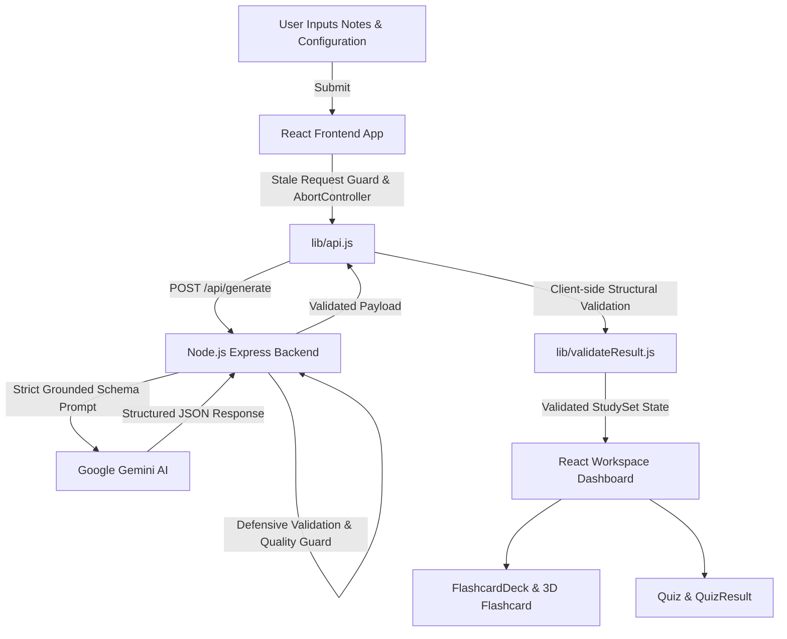

# StudyFlow AI — AI-Powered Active Learning Workspace

> **Flam Frontend Internship Assignment**  
> *Transforming free-form notes and topics into structured, active-recall study decks, self-grading quizzes, and targeted weak-area review sessions.*

---

## 🚀 1. Project Overview

**StudyFlow AI** is a specialized educational application that transforms unstructured study notes or technical topics into an interactive, active-learning workspace.

### Active Learning Loop
```
INPUT (Notes & Preferences)
   ↓
AI Organizes Knowledge (Structured JSON)
   ↓
LEARN (3D Flashcards with Category & Difficulty Badges)
   ↓
PRACTICE (Self-Grading Quiz with Explanations)
   ↓
ORAL EXAM (AI Mock Viva / Verbal Interview & Examiner Follow-ups)
   ↓
COLLABORATE (👥 Study Room / Shared Video, Voice, Sync Quiz & AI Moderator)
   ↓
IDENTIFY WEAK AREAS (Automated Category & Concept Breakdown)
   ↓
REVIEW (Filter Flashcards to Weak Topics)
   ↓
RETEST (Targeted Wrong-Answer Retry Runner or Retake Viva)
```

### Why This is NOT a Chatbot
- **Structured Data Only**: The AI model is constrained to return strictly typed JSON schema objects—never raw conversational markdown or text stream dumps.
- **Two-Tier Defensive Validation**: Both the backend proxy and client validate fields, data types, array lengths, and index bounds before rendering to UI.
- **Interactive State Machines**:
  - **3D Interactive Flashcards** with keyboard navigation (`Space`, `←`/`→`, `1`, `2`), review filtering, and session mastery tracking.
  - **Multiple-Choice Quiz** with instant visual feedback, detailed explanations, and stable question ID tracking.
  - **AI Mock Viva / Oral Examiner**: Realistic oral interview room where an AI examiner verbally questions the student, listens to their spoken answer, provides semantic evaluation (correctness, completeness, clarity), asks intelligent adaptive follow-ups, and generates a comprehensive oral examination report.
  - **👥 Study Room (Collaborative AI Learning)**: A synchronized group study room where students study the *same StudyFlow set* using real WebRTC audio/video, real-time chat, synchronized group quizzes, and a grounded AI Study Moderator.
  - **Weak-Area Focus & Wrong-Answer Retries**: Isolates missed concepts for targeted retesting without losing context.

---

## ✨ 2. Key Features

1. **Study Set Configuration Engine**:
   - **Difficulty**: Beginner, Intermediate, Advanced.
   - **Card Count**: 5, 8, or 10 Flashcards.
   - **Quiz Count**: 5, 8, or 10 Questions.
   - **Learning Mode**: Balanced, Concept Focus, Exam Focus.
2. **👥 Study Room (Collaborative AI Learning)**:
   - **Product Principle**: *"Why use StudyFlow instead of generic Zoom? Because StudyFlow understands what you are studying."*
   - **Room Management**: Unique non-sequential 6-character room codes (`OS4821`), host permissions, configurable capacity (4/6/8), privacy controls.
   - **Real WebRTC Audio & Video**: Mesh peer-to-peer media streams with genuine Web Audio API speaking volume detection, camera/mic toggle, and graceful fallback to audio-only or chat-only mode.
   - **Real-Time Group Chat**: Sanitized, XSS-safe live messaging with timestamps, system notices, and AI moderator highlight bubbles.
   - **Synchronized Group Quiz**: Host starts quiz from the shared study set; all participants receive questions simultaneously, answer independently, view group choices with respondent badges upon reveal, and get a Group Performance Leaderboard + Group Weak Areas.
   - **🧠 Grounded AI Study Moderator**: Clarifies concepts strictly within the current study topic, rejecting off-topic distractions.
   - **💡 AI Group Challenge**: Generates conceptual discussion prompts for group debate, followed by a detailed AI analysis of principles, misconceptions, and review recommendations.
   - **Host Role Transfer**: If the host disconnects, leadership transfers seamlessly to the next active participant.
3. **AI Mock Viva (Oral Interview Room)**:
   - **Positioning**: *Practice explaining concepts out loud — just like a real interview.*
   - **Animated Examiner Avatar**: Live reactive states (`speaking`, `listening`, `thinking`, `idle`) with waveform ripples, blinking eyes, and radar rings.
   - **Voice-First Interaction**: Uses Web Speech API for natural Speech Synthesis (TTS) and live Speech Recognition (STT) with real-time transcription.
   - **Graceful Manual Fallback**: Seamless switch to manual typing if speech recognition is unsupported or microphone access is disabled.
   - **Semantic Answer Evaluation**: Rates explanation across 4 criteria (Correctness, Completeness, Clarity, Relevance) with strengths and missed technical nuances.
   - **Adaptive Follow-Up Questions**: Triggers targeted follow-up questions when explanations are incomplete or surface-level (max 1 per question to ensure focused pace).
   - **Comprehensive Viva Performance Report**: Overall percentage score, 3 core skill breakdowns, question-by-question audio transcript review, and one-click "Review Weak Areas in Flashcards".
4. **Study Dashboard**:
   - High-level overview with topic title, summary, difficulty badge, estimated study time, and concept tags.
   - **Live Session Progress Tracker**:
     - Flashcards reviewed & session mastery percentage (`██████░░░░ 60%`).
     - Quiz readiness and questions answered.
     - Total session completion percentage.
5. **Smart Study Mode Switcher**:
   - 📚 **Flashcards**: Flashcards first with 3D flip and mastery sorting.
   - 🎯 **Practice Quiz**: Self-grading quiz with instant answer feedback and explanations.
   - ⚡ **Exam Mode**: Strict test conditions with streamlined progression.
   - 🎤 **Mock Viva**: Full oral examination simulation with AI examiner avatar and speech feedback.
   - 👥 **Study Room**: Synchronized collaborative study room with video, voice, chat, group quiz, and AI Moderator.
6. **Weak Area Analysis & Smart Review**:
   - Identifies specific topic categories where the user missed questions or gave incomplete oral explanations.
   - **"Review Weak Areas"**: Switches back to flashcards filtered specifically to missed categories.
   - **"Retry Wrong Answers"**: Launches an isolated quiz runner containing only missed questions.
7. **Study Set Regeneration & Settings Persistence**:
   - "Regenerate Study Set": Generates fresh questions with the same settings.
   - "Change Settings": Returns to input preserving the previous topic and configuration.
8. **One-Click Export / Copy**:
   - "Copy Study Set": Copies formatted study summary, flashcards, and quiz questions to clipboard with visual toast confirmation.
9. **Defensive Validation & Stale Request Protection**:
   - `requestIdRef` ensures slower older responses never overwrite newer user queries.
   - `AbortController` terminates pending network calls upon prompt resubmission.
   - Strict validation rejects malformed JSON, duplicate questions, and invalid quiz indices.

---

## 🛠️ 3. Tech Stack

| Layer | Technology | Purpose |
| :--- | :--- | :--- |
| **Frontend Framework** | React 18 (Functional Components + Hooks) | UI state management and component lifecycle |
| **Real-Time Communication** | Socket.IO Client + WebRTC | Signaling, synchronized room events, mesh P2P audio & video |
| **Build Tool** | Vite 6 | Lightning-fast development server & production build |
| **Icons** | Lucide React | Clean, modern SVG iconography |
| **Backend & Signaling** | Node.js + Express 4 + Socket.IO Server | HTTP proxy, room manager, WebRTC signaling & state sync |
| **AI Provider** | Google Gemini API (`@google/generative-ai`) | Structured educational JSON generation & grounded AI moderation |
| **Styling** | Modern Vanilla CSS | Custom design system, CSS variables & 3D transforms |

---

## 🏗️ 4. System Architecture & Data Contract



### JSON Schema Contract
```json
{
  "title": "Operating System Process Scheduling",
  "summary": "In-depth review of FCFS, SJF, Round Robin time quantum dynamics, and aging.",
  "metadata": {
    "difficulty": "intermediate",
    "mode": "balanced",
    "estimatedMinutes": 12,
    "topics": ["FCFS & SJF", "Round Robin & Quanta", "Starvation & Aging"]
  },
  "cards": [
    {
      "id": "card-1",
      "category": "Algorithm",
      "question": "What is First-Come, First-Served (FCFS) scheduling?",
      "answer": "A non-preemptive algorithm that allocates the CPU to processes strictly in their order of arrival.",
      "difficulty": "easy"
    }
  ],
  "quiz": [
    {
      "id": "quiz-1",
      "category": "Algorithm",
      "question": "Which scheduling algorithm is provably optimal for minimizing average waiting time?",
      "options": [
        "First-Come, First-Served (FCFS)",
        "Shortest Job First (SJF)",
        "Round Robin (RR)",
        "Priority Scheduling"
      ],
      "answer": 1,
      "explanation": "SJF executes the shortest burst times first, mathematically minimizing total waiting time.",
      "difficulty": "medium"
    }
  ]
}
```

---

## ⚙️ 5. Setup & Running Locally

### Step 1: Install Dependencies
```bash
npm install
```

### Step 2: Configure Environment Variables
Create a `.env` file in the project root:
```env
GEMINI_API_KEY=your_gemini_api_key_here
PORT=5000
```
*(Get a free key from [Google AI Studio](https://aistudio.google.com/))*

### Step 3: Run Development Server
```bash
npm run dev
```
- **Frontend App**: `http://localhost:5173`
- **Backend Proxy**: `http://localhost:5000`

### Step 4: Run Automated Verification Tests
```bash
npm test
```

### Step 5: Build for Production
```bash
npm run build
```

---

## 🧪 6. Automated Testing Suite

The project includes an automated test suite verifying all 29 core evaluation scenarios:
```bash
npm test
```

### Test Coverage Highlights:
- ✅ **Valid Study Input & Extended Metadata**: Tests `difficulty`, `mode`, `estimatedMinutes`, `topics`.
- ✅ **Boundary & Short Inputs**: Verifies handling of empty inputs and short topics (e.g. "WW2").
- ✅ **Markdown Fence Stripping**: Cleanly strips ````json ... ```` formatting.
- ✅ **Defensive Quality Constraints**: Tests rejection of missing fields, duplicate questions, identical Q&A, and invalid quiz option counts.
- ✅ **Error Categorization & Timeouts**: Tests connection downtime (503), busy rate limits (429), timeouts (408), and invalid keys (401).
- ✅ **Stale Request Guard**: Simulates async race conditions where slow older responses are discarded.
- ✅ **Stable ID Quiz Scoring & Retry**: Verifies accurate score tracking and isolation of incorrect questions for targeted retesting.
- ✅ **Weak Category Filtering & Flashcard Shuffle**: Validates dynamic filtering by weak category tags and array shuffling.

---

## 🎓 7. Flam Interview Preparation Guide

1. **Why React Hooks and functional components?**  
   *Functional components combined with hooks (`useState`, `useRef`, `useEffect`, `useCallback`) provide declarative state management, prevent memory leaks via cleanup effects, and simplify state synchronization without class lifecycle boilerplate.*
2. **Why use a backend proxy instead of calling Gemini directly from the client?**  
   *Security and sanitization. Calling LLM APIs directly from the browser exposes your API key in browser network tabs. The proxy isolates secrets, enforces payload boundaries, and performs server-side structural validation.*
3. **How do we ensure AI output is grounded in the user's specific topic?**  
   *The prompt instructs the model to ground all output strictly in the user's topic, with explicit negative constraints against reusing generic software engineering templates for non-CS topics (such as History or Biology).*
4. **How are quiz results tracked reliably without state bugs?**  
   *We use stable question IDs (`quiz-1`, `quiz-2`) consistently across submission, result dictionaries, and retry filtering. We avoid dynamic index fallbacks like `q.id || currentIndex`, which cause mismatched keys during retries.*
5. **How is stale data guarded against during rapid generation?**  
   *Using the `requestIdRef` pattern in `App.jsx` paired with `AbortController`. If a slow asynchronous request resolves after a newer request has started, the older response is discarded.*
6. **Why don't we claim factual verification?**  
   *LLMs generate probabilistic text. We validate structural schema integrity (data types, option counts, answer indices), but we label the output accurately as "AI-generated structured study sets" rather than making unsupported factual truth claims.*

---

## 📄 8. License

MIT License. Developed for the **Flam Frontend Internship Assignment**.
